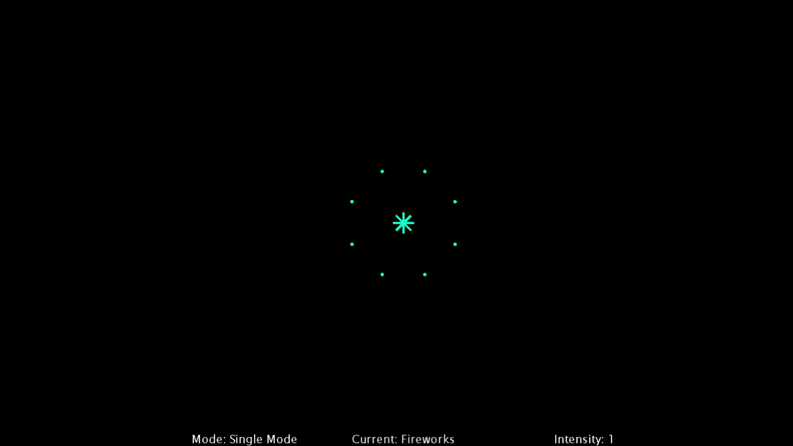

# Music Visualiser Project

Name: Daniel Kondabarov 
<br>
Student Number: C20456964

Name:
<br>
Student Number:

Name:
<br>
Student Number:

Name:
<br>
Student Number:


# Description of the assignment

# Instructions
### Setup:
1.
2.

### Controls:
| Action | Key Binding |
|--------|-------------|
|Toggle single/multi mode | b |
| Selecting visuals | 1-9 |
| Enable all | 0 |
| Increase intensity | n |
| Decrease intensity | v |

- *Toggle all* only work in in multi-mode
# How it works
- Visuals
- My visual
- Firework
- Firework arm
- Firework particle

The first thing done to this project was the structure to make it easier to work as team. This lead to the creation of two classes in ie\tudublin package, MainWindow and MyVisual. MainWindow class exist to be the only class that extends the Visual class. Since there should be only one instance of the song playing. This class does the setup and drawing for the scene. This is also the controller class for the MyVisual class. This class creates the visuals and controls the visuals using the keyboard. 

The MyVisual class is an abstract class that each of our visual inherit. MyVisual exists to make it very easy to add a new visual to the scene is just as simple is adding that visual to the ourVisual array list. The MainWindow class will do the rest. We just need to implment the abstract function in our class. The update function is for updating variables before the render function is called. The render function is used to draw the visual. Each MyVisual object needs a reference to MainWindow to access the Visual function and the PApplet functions. It also needs a name with is displayed at the bottom of the screen. There is also the booleans toggleRender (Which is used to see if MainWindow should render the visual in multi-mode) and singleMode (Which is used to see if what mode MainWindow is in).

When it comes to selecting a visual is just pressing the key between 1 and 9 and the corresponding visual will appear. I.E. When you press 1 that key press is a ASCII character. Then that character is subtracted from the ASCII character 0. This will return 1 and that one is then subtracted by 1 since arrays start at 0. In the end pressing 1 will toggle/select element 0 in the ourVisual array list. Toggling between single and multi-mode is b. And increase and decreasing intensity is n and v. What intensity does, depends on the implantation of it in each visual.

```Java
        if (key > '0' && key <= '9')
        {
            // This is done so instead of pressing 0 and 1 you can press 1 and 2 instead 
            char keyOffest = (char)((int)key - 1);
            int newIndex = asciiToInt(keyOffest);
            if(newIndex < ourVisuals.size())
            {
                currentVisual = newIndex;                    
                ourVisuals.get(currentVisual).toggleRender();
            }

        }
```
When it comes to rendering there is two modes, single mode and multi-mode. Single mode allows for a single visual to be displayed at one time. This comes with some benefits such as custom backgrounds and controls. This gives more creative freedom to create better visuals. Multi-mode allows for each visual to be rendered at the same time and then toggled on/off. In multi-mode custom backgrounds are disabled because they would overwrite over the other visuals causing to disappear. Controls are disabled as just in case the controls end up in causing some rendering bug to appear. Below is the code how both mutli-mode and single mode is rendered. 
```Java
        // This checks if the selected visual is within the ourVisuals arrayList
        if(currentVisual < ourVisuals.size())
        {       
            if (singleMode) 
            {
                // This just renders a single visual
                ourVisuals.get(currentVisual).update();
                ourVisuals.get(currentVisual).render();
            }
            else 
            {
                // It renders the background first then render all the currently active visuals
                background(defaultColor);
                for(MyVisual v:ourVisuals)
                {
                    if(v.shouldRender())
                    {
                        v.update();
                        v.render();
                    }
                }
            }
        }
        // This renders the all the visuals in multi-mode
        else if(currentVisual == ourVisuals.size())
        {
            background(defaultColor);
            for(MyVisual v:ourVisuals)
            {
                // Set true so that each visual stays rendering after 0 is not selected
                if(!v.shouldRender()) v.toggleRender();
                v.update();
                v.render();
            }
        }
```
There were some changes to Visual with the addition of a beat detector from the minim package. The beat detector requires a class to implementation audioListener to be able to detect beats. Once implemented, the beat detector can detect hats, kicks and snares in the song. 

### Daniel's Fireworks visual:
The Visual I made was a firework show. Every time the beat detector detects a hat a new firework is created. The firework is assigned a random position on the screen. It’s then given a colour based on the first band taken from the FFT object. It is then added to the array list of fireworks. There is a limit of ten fireworks in the array list. This is to not fill the screen full of fireworks. The reason for the array list instead of an array is because I use the array list as queue for the fireworks. The fireworks in the front of the queue explode and get removed first. When the beat detector detects a kick, a firework explodes. When the firework is starts to explode it triggers a countdown. Only when the countdown is over can that firework be removed from the array list. This countdown exist to allow the firework to play the explosion animation. Without it the firework just get removed before the animation plays. The animation is quick because while the firework is exploding no new fireworks can be added to the screen. Having the firework explode quickly means it can sync better to the song. The intensity implementation here that the fireworks increase in scale. This done by using the scale() from PApplet.

The firework is made up of two components firework arms and firework particles. The firework arms are the lines seen on the fireworks. The firework particles are the circles in-between the firework arms. Each firework is made up of 8 firework arms and firework particles. When creating the firework, there is a for loop between 0 and 16. It alternates between a firework arm and the firework particle. It starts with a firework arm with a starting position of x: 0 and y:-100 and a rotation of 0 radians. The angle is calculated by (2π/16)*index in the for loop.
```Java
		float angle = PApplet.TWO_PI/16;

        for (int i = 0; i < 16; i++) {
            addArmOrParticle(0, -100, i*angle);
        }
```
The first thing done by both the arm and particle is pushMatrix(). This is done to prevent the rotation from affecting any part of the firework. The rotation is done using the rotation value given when it was created. Then popMatrix() after the render is done.  The firework arm is line drawn using liner interpolation. The line is drawn at the 0,0 to the result of the liner interpolation function between the current cords and target cords. When the current cords reach the target cords, it starts to draw the line decreasing towards the target cords. For the particles, they work similar to the firework arms but it increase/decrease the radius instead. The reason that both are classes is because it more easier to have a class with the data it needs encapsulated then to create a function in the firework class and keep track of the rotations and target co-ordinates needed in multiple arrays.



# What I am most proud of in the assignment
### Daniel:

# Markdown Tutorial

This is *emphasis*

This is a bulleted list

- Item
- Item

This is a numbered list

1. Item
1. Item

This is a [hyperlink](http://bryanduggan.org)

# Headings
## Headings
#### Headings
##### Headings

This is code:

```Java
public void render()
{
	ui.noFill();
	ui.stroke(255);
	ui.rect(x, y, width, height);
	ui.textAlign(PApplet.CENTER, PApplet.CENTER);
	ui.text(text, x + width * 0.5f, y + height * 0.5f);
}
```

So is this without specifying the language:

```
public void render()
{
	ui.noFill();
	ui.stroke(255);
	ui.rect(x, y, width, height);
	ui.textAlign(PApplet.CENTER, PApplet.CENTER);
	ui.text(text, x + width * 0.5f, y + height * 0.5f);
}
```

This is an image using a relative URL:


This is an image using an absolute URL:


This is a youtube video:

[](https://www.youtube.com/watch?v=J2kHSSFA4NU)

This is a table:

| Heading 1 | Heading 2 |
|-----------|-----------|
|Some stuff | Some more stuff in this column |
|Some stuff | Some more stuff in this column |
|Some stuff | Some more stuff in this column |
|Some stuff | Some more stuff in this column |

